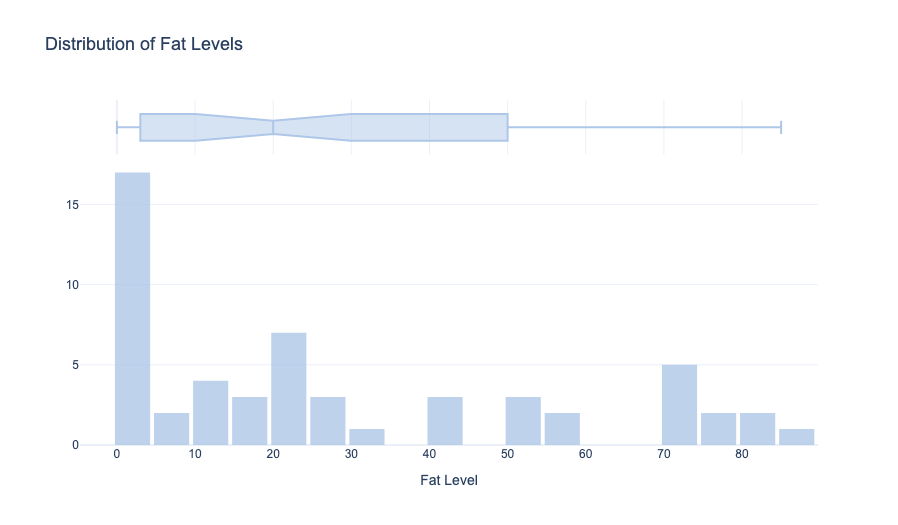
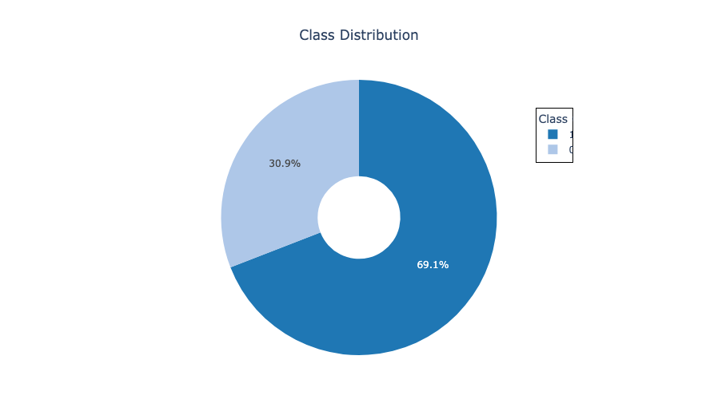

# Dataset Analysis and Model Training

## Overview
This repository contains code for analyzing a dataset of **B-mode fatty liver ultrasound images** and training machine learning models for classification. The dataset is sourced from **Byra et al. (2018)** and includes liver images labeled with fat levels.

## Dataset
- **Source:** [Dataset of B-mode fatty liver ultrasound images](https://www.kaggle.com/datasets/shanecandoit/dataset-of-b-mode-fatty-liver-ultrasound-images)
- **Reference:** Byra, M. et al., *Transfer Learning with Deep Convolutional Neural Network for Liver Steatosis Assessment in Ultrasound Images*, *International Journal of Computer Assisted Radiology and Surgery*, 2018. DOI: [10.1007/s11548-018-1843-2](https://doi.org/10.1007/s11548-018-1843-2).
- **Contents:**
  - **Images:** B-mode ultrasound scans
  - **Fat Levels:** Quantitative fat assessment
  - **Classes:** Normal vs. fatty liver classification

## Data Preprocessing
- **Image resizing:** Standardized to `(299, 299, 3)` using `tensorflow.image.resize`.
- **Normalization:** Pixel values scaled to `[0, 1]`.
- **Feature Extraction:** Pre-trained CNNs used for feature extraction.

## Exploratory Data Analysis (EDA)
### Fat Level Distribution


### Class Distribution


## Model Training
### Baseline Models
- **Random Forest (RF)** on CNN-extracted features
- **SVM (RBF Kernel)** for classification
- **XGBoost (Tuned with Optuna/GridSearchCV)**

### Advanced Model
- **Stacking Model**: RF + SVM combined, followed by an XGBoost meta-classifier
- **SMOTE for class balancing**
- **Principal Component Analysis (PCA) for feature reduction**

## Performance Metrics
| Model              | Accuracy |
|--------------------|----------|
| Random Forest     | 83.6%    |
| XGBoost          | 74.5%    |
| SVM              | 78.2%    |
| Stacking + XGBoost | 88.2%    |

## How to Use
### Setup
1. **Clone the repository:**
   ```sh
   git clone https://github.com/Pineappledeydre/B-mode_Ultrasound_NAFLD.git
   ```
2. **Install dependencies:**
   ```sh
   pip install -r requirements.txt
   ```
3. **Run the analysis:**
